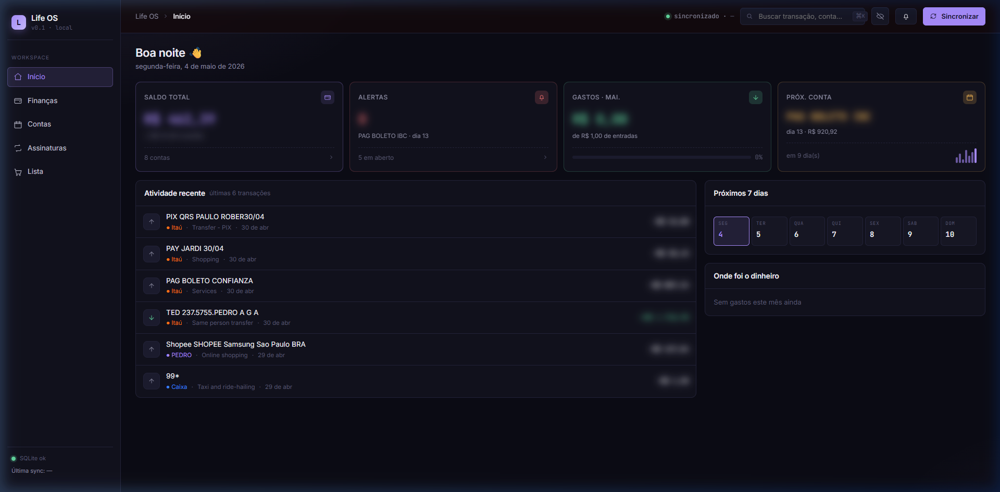
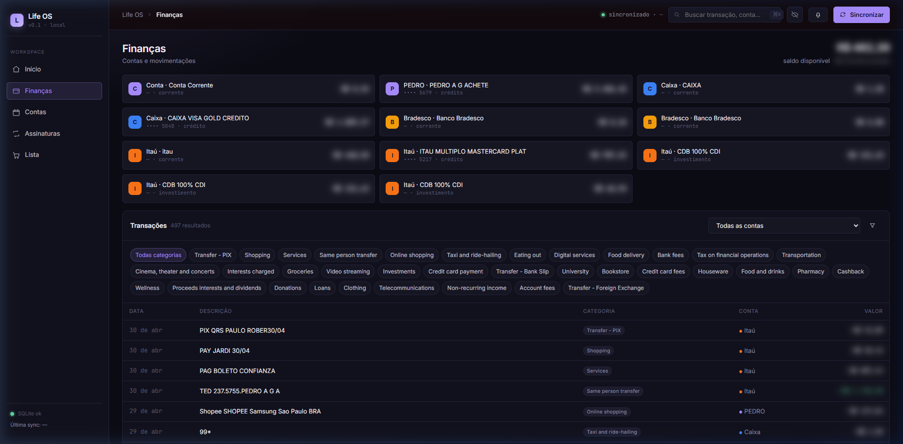
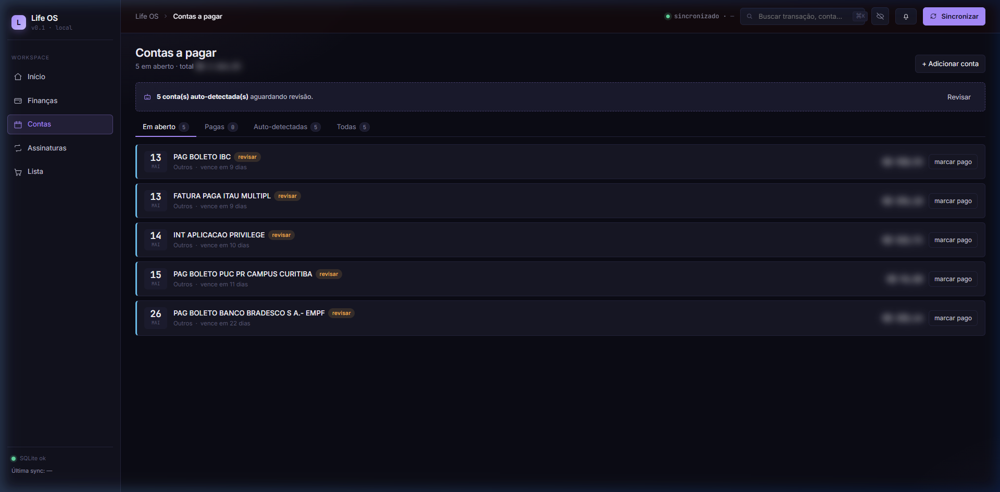
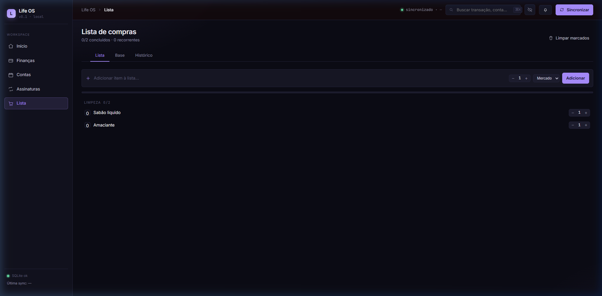

<p align="center">
  
</p>

<h1 align="center">
  Life OS
</h1>

<p align="center">
  <strong>Your personal finance command center — local-first, privacy-focused, and fully open source.</strong>
</p>

<p align="center">
  <a href="#-features">Features</a> •
  <a href="#-screenshots">Screenshots</a> •
  <a href="#-quick-start">Quick Start</a> •
  <a href="#-tech-stack">Tech Stack</a> •
  <a href="#-project-structure">Structure</a> •
  <a href="#-pluggy-integration">Pluggy</a> •
  <a href="#-roadmap">Roadmap</a> •
  <a href="#-contributing">Contributing</a>
</p>

<p align="center">
  
  
  
  
  
</p>

---

## Why Life OS?

Most personal finance apps are either **cloud-locked SaaS** that hold your data hostage, or **spreadsheets** that require manual upkeep. Life OS is different:

- 🏠 **Local-first** — Your data lives in a single SQLite file on your machine. No cloud, no subscriptions, no vendor lock-in.
- 🔌 **Bank sync** — Connects to 300+ Brazilian banks via [Pluggy](https://pluggy.ai) to auto-import accounts, transactions, and investments.
- 🧠 **Smart detection** — Automatically identifies recurring bills and subscriptions from your transaction history.
- 🔒 **Privacy mode** — One-click blur toggle to safely share your screen or take screenshots without exposing financial data.
- 🛒 **Beyond finance** — Includes a full shopping list system with base lists, session history, and purchase frequency tracking.

---

## ✨ Features

### 💰 Financial Dashboard
- **KPI cards** — Total balance, monthly spending, alerts, and next upcoming bill at a glance
- **Recent activity** — Latest transactions with bank color-coding and category tags
- **7-day calendar strip** — Visual preview of bills due in the next week
- **Category allocation** — Where your money is going this month

### 📊 Finances Page
- **All accounts** — Checking, credit, and investment accounts with live balances
- **Transaction explorer** — Browse 90 days of history with category filter chips
- **Multi-bank support** — Itaú, Bradesco, Caixa, Nubank, Inter, and 300+ more via Pluggy

### 📅 Bills & Subscriptions
- **Bills tracker** — Due dates, amounts, urgency indicators, and one-click "mark as paid"
- **Auto-detection** — Bills and subscriptions are automatically discovered from transaction patterns
- **Review workflow** — Auto-detected items are flagged for your review before being confirmed
- **Subscription grid** — Card-based view of all active subscriptions with billing day alerts

### 🛒 Shopping List
- **Smart quantities** — Inline +/- controls on every item
- **Category grouping** — Items organized by Hortifruti, Mercado, Limpeza, Outros
- **Base list** — Save your recurring items and copy them to start a new shopping trip
- **Session history** — Every completed shopping trip is saved with full item details
- **Frequency ranking** — See which items you buy most often

### 🔒 Privacy & UX
- **Privacy mode** — Blurs all financial values; hover to peek, or toggle off entirely
- **Dark theme** — Premium dark UI with violet accent, glassmorphism, and subtle grid background
- **Responsive layout** — Clean grid that adapts from laptop to ultrawide

---

## 📸 Screenshots

<details>
<summary><strong>🏠 Dashboard</strong></summary>
<br/>

</details>

<details>
<summary><strong>📊 Finances</strong></summary>
<br/>

</details>

<details>
<summary><strong>📅 Bills</strong></summary>
<br/>

</details>

<details>
<summary><strong>🛒 Shopping List</strong></summary>
<br/>

</details>

---

## 🚀 Quick Start

### Prerequisites

- **Node.js** 18+ 
- **npm** 9+
- (Optional) A [Pluggy](https://pluggy.ai) account for bank sync

### 1. Clone & Install

```bash
git clone https://github.com/YOUR_USERNAME/lifeos.git
cd lifeos
npm install
```

### 2. Configure Environment

```bash
cp .env.local.example .env.local
```

Edit `.env.local` with your Pluggy credentials (optional — the app works without them, you just won't have bank sync):

```env
PLUGGY_CLIENT_ID=your_client_id
PLUGGY_CLIENT_SECRET=your_client_secret
PLUGGY_ITEM_IDS=item_id_1,item_id_2
```

### 3. Initialize Database

```bash
npm run db:push
```

This creates the `lifeos.db` SQLite file with all tables.

### 4. Run

```bash
npm run dev
```

Open **http://localhost:3000** — that's it! 🎉

---

## 🛠 Tech Stack

| Layer | Technology | Why |
|-------|-----------|-----|
| **Framework** | Next.js 14 (App Router) | Server Components for zero-JS data loading, API routes for mutations |
| **Database** | SQLite + better-sqlite3 | Single file, zero config, instant queries, no external service |
| **ORM** | Drizzle ORM | Type-safe schema, lightweight, `db:push` for schema sync |
| **Bank Sync** | Pluggy SDK | Open Banking API for 300+ Brazilian banks |
| **Testing** | Vitest | Fast, TypeScript-native, Vite-powered |
| **Language** | TypeScript 5 | End-to-end type safety |
| **Styling** | Vanilla CSS | Custom design system with CSS variables, no utility framework bloat |

---

## 📁 Project Structure

```
lifeos/
├── src/
│   ├── app/                    # Next.js App Router
│   │   ├── page.tsx            # Home / Dashboard
│   │   ├── financas/           # Finances page
│   │   ├── contas/             # Bills page
│   │   ├── assinaturas/        # Subscriptions page
│   │   ├── lista/              # Shopping list + base + histórico
│   │   ├── api/                # REST API routes
│   │   │   ├── accounts/       # Account endpoints
│   │   │   ├── bills/          # Bills CRUD
│   │   │   ├── shopping/       # Shopping list + base + sessions + frequency
│   │   │   ├── subscriptions/  # Subscriptions endpoints
│   │   │   ├── sync/           # Pluggy sync trigger
│   │   │   └── transactions/   # Transaction endpoints
│   │   └── globals.css         # Full design system (tokens + components)
│   ├── components/
│   │   ├── atoms/              # Icon component
│   │   ├── pages/              # Page-specific components
│   │   │   ├── home/           # KPI grid, recent activity, calendar, categories
│   │   │   ├── financas/       # Account chips, transaction table
│   │   │   ├── contas/         # Bills list
│   │   │   ├── assinaturas/    # Subscription cards
│   │   │   └── lista/          # Shopping list, base list, histórico, modal
│   │   └── shell/              # Sidebar + Topbar
│   ├── db/
│   │   ├── schema.ts           # Drizzle schema (9 tables)
│   │   └── client.ts           # DB connection
│   ├── lib/
│   │   ├── pluggy.ts           # Pluggy sync engine + auto-detection
│   │   ├── auto-detect.ts      # Bill & subscription pattern detection
│   │   ├── shopping-frequency.ts # Purchase frequency ranking
│   │   ├── bank-colors.ts      # Bank → brand color mapping
│   │   ├── fmt.ts              # Currency formatting (BRL)
│   │   ├── dates.ts            # Date utilities
│   │   └── settings.tsx        # Settings context (density, privacy)
│   └── __tests__/              # Vitest test suites
├── drizzle.config.ts           # Drizzle Kit configuration
├── lifeos.db                   # SQLite database (gitignored)
└── package.json
```

---

## 🔌 Pluggy Integration

Life OS uses [Pluggy](https://pluggy.ai) — a Brazilian Open Banking aggregator — to connect to your bank accounts.

### What Gets Synced

| Data | Source | Behavior |
|------|--------|----------|
| **Checking accounts** | Bank API | Balance updated, transactions imported |
| **Credit cards** | Bank API | Balance + transactions; invoice payment dupes filtered |
| **Investments** | Bank API | CDB, LCI, LCA, Tesouro — balance tracked |
| **Bills** | Auto-detected | Recurring debits from checking → flagged for review |
| **Subscriptions** | Auto-detected | Recurring charges from all accounts → auto-created |

### How Auto-Detection Works

The sync engine analyzes your transaction history to find:

1. **Subscriptions** — Same merchant, similar amount (±20%), appearing 2+ months → auto-created as subscription
2. **Bills** — Recurring debits from checking accounts on consistent days → created with `needsReview: true`

You review auto-detected items before they become permanent.

### Getting Pluggy Credentials

1. Sign up at [pluggy.ai](https://pluggy.ai)
2. Create an application in the dashboard
3. Use the Pluggy Widget to connect your bank accounts — each connection gives you an **Item ID**
4. Add your Client ID, Client Secret, and Item IDs to `.env.local`

> **No Pluggy? No problem.** The app runs fully offline — you can manually add bills, subscriptions, and shopping items without any bank integration.

---

## 🧪 Testing

```bash
# Run tests once
npm run test:run

# Watch mode
npm test
```

Current test coverage:
- `auto-detect.test.ts` — Bill and subscription pattern detection (9 tests)
- `fmt.test.ts` — Currency formatting (6 tests)
- `shopping-frequency.test.ts` — Purchase frequency ranking (6 tests)

---

## 🗺 Roadmap

- [ ] **Budgets** — Set monthly limits per category with progress tracking
- [ ] **Goals** — Savings goals with visual progress bars
- [ ] **Export** — CSV/PDF export of transactions and reports
- [ ] **Multi-currency** — Support for USD, EUR alongside BRL
- [ ] **Mobile PWA** — Installable progressive web app for mobile use
- [ ] **Notifications** — Bill due date reminders via browser notifications
- [ ] **Import** — CSV import for banks not supported by Pluggy
- [ ] **Charts** — Spending trends, income vs. expenses over time

---

## 🤝 Contributing

Contributions are welcome! Here's how to get started:

1. **Fork** the repository
2. **Create** a feature branch: `git checkout -b feat/my-feature`
3. **Commit** your changes: `git commit -m "feat: add my feature"`
4. **Push** to the branch: `git push origin feat/my-feature`
5. **Open** a Pull Request

### Development Tips

- The design system lives entirely in `globals.css` — check existing CSS variables before adding new styles
- Server Components load data; Client Components handle interactivity
- All API routes are under `src/app/api/` and use Drizzle ORM for DB access
- Run `npm run db:push` after any schema changes

---

## 📄 License

This project is licensed under the **MIT License** — see the [LICENSE](LICENSE) file for details.

---

<p align="center">
  <strong>Built with ☕ and frustration with existing finance apps.</strong>
  <br/>
  <sub>If Life OS helps you, give it a ⭐ — it means a lot!</sub>
</p>
